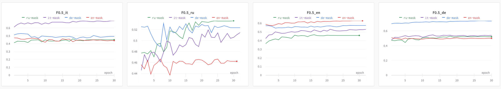

# Multilingual-GEC

With the introduction of language models, there has been a growing interest in leveraging these technologies for improving Grammatical Error Correction (GEC) systems. Training large-scale language models on vast amounts of text data has shown remarkable success in capturing the syntactic and semantic patterns of languages. However, the effect of the pre-training of these models to acquire grammatical knowledge in multiple languages and whether it can be effectively harnessed for GEC remains a subject of investigation.  In this thesis, we explore two crucial questions that have significant implications for the field of GEC. The first question we consider is whether models show transferability between languages. To answer this question, we explore techniques to transfer this knowledge to improve systems performances on several languages even without training in that language and we investigate the multilingual transfer of pre-trained language models and assess their performance in grammatical error correction tasks in zero-shot. The second question is which is the impact of error detection in the Grammatical Error Correction task. The capability of detection for a model plays a crucial role in assessing the performance of GEC systems.  We aim to shed light on the impact of error detection on the GEC models by conducting experiments that isolate the detection component and analyze its effect on the overall performance. We test this by providing input to a model that allows the model to effectively detect the errors and based on a comparison with a model that does not make use of this input study how we can solve problems of data paucity for GEC. We studied then the impact of error detection in different languages evaluating the models in zero-shot on each language. From the performance comparison, we show how the detection influence on the GEC performances can relieve the problem of data paucity even if used in zero-shot. In the end, we also show how a model without the influence of error detection presents worse performance with respect to models that know the position of the errors but that are evaluated in zero-shot. 

